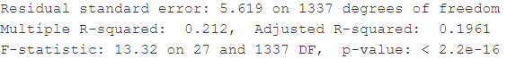

```{r setup, include=FALSE}
knitr::opts_chunk$set(echo = TRUE)
library(ggplot2)
library(dplyr)
library(GGally)
library(ISLR)
library(caret)
library(MASS)
library(class)
library(knitr)
library(leaps)
library(glmnet)
library(boot)
library(gam)
library(tree)
library(gbm)
library(randomForest)
library(e1071)

```

## Background - "Expected" metrics

- In sports analytics, "expected" metrics are used to evaluate player or team performance
  - Soccer: Expected goals (xG) $^{[1]}$, expected assists, expected points
  - Basketball: Expected points, expected possession value $^{[2]}$
  - Football: Expected Yards after Catch $^{[3]}$
  
- Many uses for these metrics
  - Compare a player's output to an objective baseline
  - Evaluate a team's performance by eliminating randomness
  
## Expected Yards After Fielding (xYAF)

- Given the current conditions when fielding a punt, how many yards do we expect the punt returner to gain

- Takes into account
  - Punt position
  - Fielding position
  - All defender positions (relative)
  - Punt hang time
  
- Should return an accurate estimate of how many yards the player gains based on these factors

## Data

- NFL 2022 Big Data Bowl
  - "The annual sports analytics contest from NFL Football Operations challenges members of the analytics community to contribute to the NFL’s continuing evolution of the use of advanced analytics."
  - Last year's winner: "A Defensive Player Coverage Evaluation Framework"$^{[3]}$
  - This year, focuses on Special Teams Plays
  - Contains 19,979 plays from 2018 to 2020
  
- After filtering, we predict based on ~2000 returned punts


# Model Evaluations

## Linear Regression

{width=80%}

## Linear Regression

{width=80%}
{width=80%}
{width=80%}

## Linear Regression

{width=80%}


## Logistic Regression

{width=80%}
{width=80%}
{width=80%}

## Best Subset Selection (Forward, Backward)

{width=80%}

## Best Subset Selection (Forward, Backward)

{width=80%}

## Best Subset Selection (Forward, Backward)

{width=80%}

## Best Subset Selection (Forward, Backward)

{width=80%}

## Best Subset Selection (Forward, Backward)

{width=80%}

## Best Subset Selection (Forward, Backward)

{width=80%}

## Random Forests

{width=80%}

## Random Forests

{width=80%}

## Random Forests

{width=80%}

## LASSO/Ridge Regression

{width=80%}

## GAMs

{width=60%}

## GAM

{width=80%}

## Splines

{width=80%}

## Boosting

{width=80%}

## Model Comparison


# Evaluation and Conclusion

## Evaluation

Problem: Some methods assume normally distributed data

```{r, echo = FALSE, message = FALSE}
data = read.csv("Data/puntinfo.csv")
n <- ggplot(data = data, aes(x = yards_gained, fill = ..x..)) + 
  geom_histogram(bins=100) + 
  scale_fill_gradient2(low='darkblue', mid='blue', high='lightblue', midpoint=-5, name = 'Yards Gained')

suppressWarnings(print(n))
```

## Evaluation

Possible solution: Variable Transforms

```{r, echo = FALSE, message = FALSE}
l <- ggplot(data = data, aes(x = log(yards_gained), fill = ..x..)) + 
  geom_histogram(bins=100) + 
  scale_fill_gradient2(low='darkblue', mid='blue', high='lightblue', midpoint=0, name = 'Yards Gained')

suppressWarnings(print(l))
```

## Evaluation


```{r, echo = FALSE, message=FALSE}
l <- ggplot(data = data, aes(x = sqrt(yards_gained), fill = ..x..)) + 
  geom_histogram(bins=100) + 
  scale_fill_gradient2(low='darkblue', mid='blue', high='lightblue', midpoint=0, name = 'Yards Gained')

suppressWarnings(print(l))
```

Better, but also doesn't handle negative values.

## Examples


Predicted: 4.78 yards

## Examples


Predicted: 1.52 yards

## Works Cited

[1] Sam Green. Assessing the performance of Premier League goalscorers. Stats Perform, 2012.

[2] https://grantland.com/features/expected-value-possession-nba-analytics/

[3] https://www.nfl.com/news/next-gen-stats-intro-to-expected-yards-after-catch-0ap3000000983644

[4] Peng et. al., A Defensive Player Coverage Evaluation Framework, https://www.kaggle.com/model284/a-defensive-player-coverage-evaluation-framework
